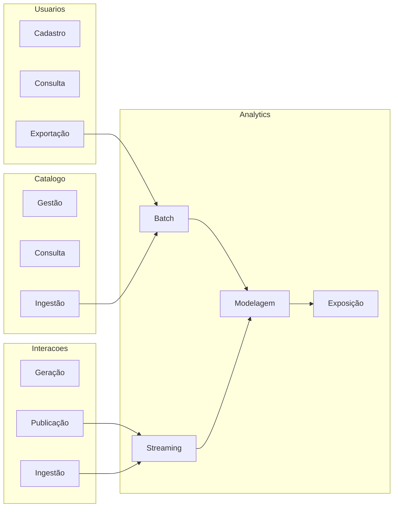

# 3. Domínios e Serviços

## 3.1 Domínios

O projeto é organizado em **4 domínios principais**, cada um com responsabilidades específicas:

| Domínio          | Responsabilidade                                     |
| ---------------- | ---------------------------------------------------- |
| Usuário          | Gerenciar dados cadastrais e identidade dos usuários |
| Catálogo Musical | Gerenciar metadados das músicas                      |
| Interações       | Capturar eventos e comportamento em tempo real       |
| Analytics        | Transformar dados em insights                        |

---

## 3.2 Serviços por Domínio

| Domínio    | Serviço    | Responsabilidade                |
| ---------- | ---------- | ------------------------------- |
| Usuários   | Cadastro   | Criar e atualizar usuários      |
| Usuários   | Consulta   | Disponibilizar dados            |
| Usuários   | Exportação | Gerar dados batch               |
| Catálogo   | Gestão     | Manter músicas                  |
| Catálogo   | Consulta   | Fornecer metadados              |
| Catálogo   | Ingestão   | Carregar datasets               |
| Interações | Geração    | Simular eventos                 |
| Interações | Publicação | Enviar eventos                  |
| Interações | Ingestão   | Persistir eventos               |
| Analytics  | Batch      | Processar dados históricos      |
| Analytics  | Streaming  | Processar eventos em tempo real |
| Analytics  | Modelagem  | Organizar dados                 |
| Analytics  | Exposição  | Servir dados                    |

---

### Comunicação entre Serviços

Os serviços são **fracamente acoplados** e a comunicação pode ocorrer por:

* Arquivos (modo simples)
* Mensageria (ex: Kafka)

---

## 3.3 Diagrama de Domínios e Serviços

---
