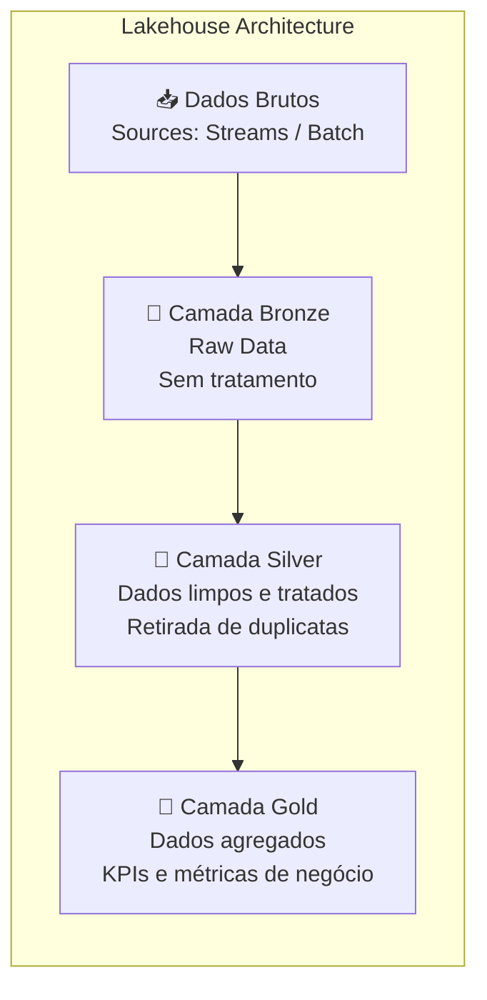
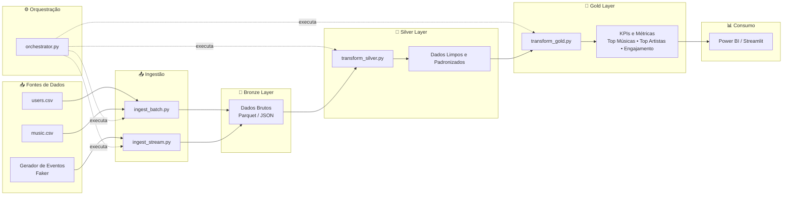
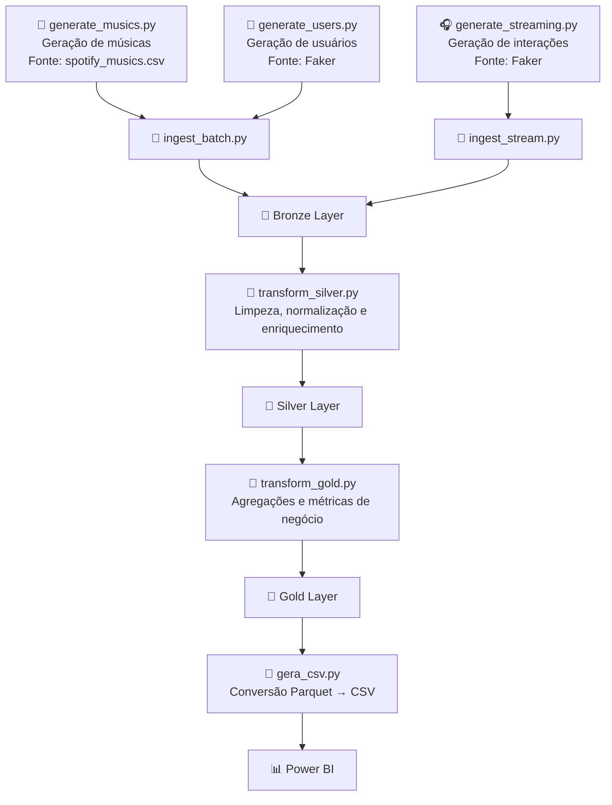

# Music Streaming Analytics Pipeline

---

| Nome | RA |
|---|---|
| Gustavo Monteiro Fonseca | 22353243 |

---
### Visualização de dados após execução do pipeline


---
### Como executar o código
1. Crie uma imagem
      Abra um terminal na pasta do projeto com o comando
   
               cd MusicStreamingPipeline
      Depois crie a imagem
    
               docker build -t music-pipeline .
2. Execute o container

               docker run -v ${PWD}/data:/app/data music-pipeline


## 1. Descrição do Projeto

### Contexto de Negócio

Uma plataforma fictícia de streaming de música deseja melhorar a experiência do usuário por meio de recomendações personalizadas, além de otimizar decisões de negócio com base no comportamento de escuta.

### Problema

Os dados de uso (reproduções, interações e preferências) estão dispersos e não estruturados, dificultando análises e geração de insights.

### Objetivos

* Centralizar dados de consumo musical
* Permitir análises históricas e em tempo real
* Suportar sistemas de recomendação
* Monitorar métricas de uso (engajamento, retenção)

### Stakeholders

* Equipe de Data / BI
* Equipe de Produto
* Equipe de Marketing
* Usuários finais (indiretamente)

---

## 2. Definição e Classificação dos Dados

### Fontes de Dados

| Fonte              | Descrição             | Formato | Volume   | Frequência    | Latência |
| ------------------ | --------------------- | ------- | -------- | ------------- | -------- |
| Interações         | Play, likes e skips   | JSON    | ~50k/dia | Streaming     | Segundos |
| Usuários           | Dados cadastrais      | CSV/SQL | ~10k     | Batch diário  | 24h      |
| Catálogo de música | Metadados musicais    | CSV     | ~30k     | Batch semanal | 7 dias   |

### Classificação

**Dados Operacionais**

* Estruturados (CSV/SQL)
* Atualização baixa frequência
* Ex: usuários e catálogo

**Dados de Streaming**

* Semi-estruturados (JSON)
* Alta frequência e baixa latência
* Ex: reproduções e interações

### Resumo

* Origem: simulação + datasets externos
* Formatos: JSON, CSV
* Latência: segundos (streaming) / horas (batch)

---

## 3. Domínios e Serviços

### Domínios

| Domínio    | Responsabilidade      |
| ---------- | --------------------- |
| Usuário    | Dados cadastrais      |
| Catálogo   | Metadados musicais    |
| Interações | Eventos em tempo real |
| Analytics  | Insights              |

---

### Serviços

| Domínio    | Serviço    | Função                  |
| ---------- | ---------- | ----------------------- |
| Usuários   | Cadastro   | Criar usuários          |
| Usuários   | Consulta   | Ler dados               |
| Usuários   | Exportação | Batch                   |
| Catálogo   | Gestão     | Manter músicas          |
| Catálogo   | Consulta   | Metadados               |
| Catálogo   | Ingestão   | Carregar dados          |
| Interações | Geração    | Simular eventos         |
| Interações | Publicação | Enviar eventos          |
| Interações | Ingestão   | Persistir               |
| Analytics  | Batch      | Processamento histórico |
| Analytics  | Streaming  | Tempo real              |
| Analytics  | Modelagem  | Estruturar dados        |
| Analytics  | Exposição  | Servir dados            |

---

## 4. Arquitetura — Fluxo de Dados

### Arquitetura

## 🏗️ Arquitetura 


### Justificativa da arquitetura

A escolha do modelo Lakehouse permite combinar a Flexibilidade do Data Lake (dados brutos e variados) e a estrutura analítica de um Data Warehouse. Além disso reduz custo (armazenamento barato), permite múltiplos tipos de processamento e facilita evolução do projeto.
Já a arquitetura Medalhão (Bronze, Silver, Gold) utiliza camadas, melhorando a qualidade dos dados, governança e reprodutibilidade.

### Camadas

* Bronze: dados brutos sem transformação
* Silver: dados tratados
      Transformações realizadas:
        Remoção de duplicidades
        Tratamento de valores ausentes
        Conversão de datas
        Padronização de nomes de colunas
        Validação de tipos de dados
* Gold: dados agregados e prontos para consumo

  

### Fluxo

1. Origem (eventos + dados batch)
2. Ingestão (streaming e batch)
3. Armazenamento (Data Lake)
4. Processamento
5. Consumo
   
  ## 🏗️ Arquitetura do Pipeline




### Estrutura

```bash
project/
├── scripts/
│   ├── generate_musics.py
│   ├── generate_streaming.py
|   ├── generate_users.py
|   ├── gera_csv.py
│   ├── ingest_batch.py
│   ├── ingest_stream.py
│   ├── transform_silver.py
│   ├── transform_gold.py
│   └── orchestrator.py
│
├── data/
│   ├── raw/    
│   ├── bronze/   
│   ├── silver/
│   └── gold/
│
├── logs/
│   └── pipeline.log
│
└── README.md
```


### Armazenamento
O armazenamento será baseado em um Data Lake local, organizado segundo a arquitetura medalhão, onde os dados brutos serão armazenados no formato JSON/CSV e os dados tratados e agregados em Parquet.
Estrutura: 
•	Bronze → dados brutos 
•	Silver → dados tratados 
•	Gold → dados agregados 
Os dados Bronze não terão alterações e serão armazenados como obtidos.

### Processamento e transformação
O processamento será realizado em dois modos:
•	Batch: Utilizando Python com pandas para limpeza de dados, junções entre tabelas e agregações (ex: top músicas) 
•	Streaming (simplificado):
Processamento incremental dos eventos à medida que chegam (simulado) 

### Orquestração
A execução do pipeline é realizada pelo script python orchestrator.py, responsável por gerenciamento de fluxos de trabalho (Data Pipelines): Em projetos de dados (como ETL), ele garante que uma etapa de extração só comece após a conclusão da limpeza dos dados, controlando a dependência entre as tarefas. 
No caso deste projeto, controlará a geração dos dados, ingestão e transformação.

Etapas executadas:
1.  generate_musics.py, geração do arquivo de músicas a partir do arquivo spotfy_musics.csv
2.	generate_streaming.py, geração do arquivo de interações a partir do faker
3.	generate_users.py, geração do arquivo de usuários a partir do faker
4.	ingest_batch.py, ingestão dos dados de usuários e músicas na camada bronze
5.	ingest_stream.py, ingestãos dos dados de interações na camada bronze
6.	transform_silver.py, transformação dos dados bronze em silver
7.	transform_gold.py, transformação dos dados silver em golg, deixando-os prontos para consumo
8.	gera_csv, cópia dos arquivos .parquet para .csv para utilização no Power BI

   ## 🔄 Fluxo do Pipeline de Dados


### Indicadores Disponibilizados
* Top Músicas - Ranking das músicas mais reproduzidas
* Top Artistas - Ranking dos artistas mais reproduzidos
* Plays por Gênero - Distribuição de reproduções por gênero musical
* Engajamento
  Comparação entre:
    Play
    Like
    Skip
* Usuários Mais Ativos - Ranking dos usuários com maior quantidade de interações.
* Evolução Diária - Quantidade de reproduções ao longo do tempo.

### Qualidade dos Dados
Validações implementadas:
* Remoção de duplicidades
* Tratamento de nulos
* Conversão de datas
* Validação de tipos de dados

### Monitoramento
O pipeline gera logs de execução contendo:
* Início e término de cada etapa
* Quantidade de registros processados
* Erros de execução
Arquivo:
  logs/pipeline.log

   
### Trade-offs
Os trade-offs foram considerados visando equilibrar simplicidade de implementação em ambiente acadêmico com boas práticas de arquiteturas modernas de dados. 

* Alta escalabilidade
* Baixo custo
* Maior complexidade (batch + streaming)

Justificativa:
O uso de pandas é suficiente para volumes moderados e ambiente acadêmico, enquanto Spark pode ser introduzido para simular cenários de escala.

---

## 5. Tecnologias

Inicialmente, a ideia era utilizar as tecnologias descritas abaixo:
| Tecnologia          | Função             |
| ------------------- | ------------------ |
| Python + Faker      | Simulação          |
| PostgreSQL          | Dados operacionais |
| Kafka (opcional)    | Streaming          |
| Airbyte             | Ingestão           |
| Data Lake           | Armazenamento      |
| Parquet             | Otimização         |
| Pandas              | Processamento      |
| Spark (opcional)    | Escala             |
| Airflow             | Orquestração       |
| Power BI / Metabase | Visualização       |
| FastAPI             | API                |

Principais adaptações em relação ao planejamento original
* Kafka → substituído por um gerador de eventos em Python (Faker) que grava arquivos JSON na camada Bronze, reduzindo a complexidade operacional, mas mantendo o conceito de streaming
* Airflow → substituído por um script orchestrator.py que executa o pipeline de ponta a ponta
* Spark → substituído por pandas, adequado ao volume de dados do protótipo
* PostgreSQL → substituído por arquivos CSV/Parquet para simplificar a implantação, já que simplifica a configuração e mantém o fluxo ETL
* Fast API → substituído pelo Power BI, utilizando como camada de consumo os dados da Gold. 

| Tecnologia          | Função                          |
| ------------------- | --------------------------------|
| Python              | Desenvolvimento dos pipelines   |
| Faker               | Geração de dados simulados      |
| Parquet             | Armazenamento otimizado         |
| Pandas              | Processamento de dados          |
| JSON                | Eventos de streaming            |
| Power BI            | Visualização  e análise         |
| Git/GitHub          | Versionamento                   |

________________________________________


## 6. Considerações Finais

### Riscos

| Risco                   | Mitigação             |
| ----------------------- | --------------------- |
| Infraestrutura limitada | Uso de pandas         |
| Complexidade streaming  | Kafka opcional        |
| Dados simulados         | Faker                 |
| Integração              | Parquet               |
| Orquestração            | Airflow               |
| Escalabilidade          | Arquitetura preparada |

---


### Referências

* Databricks — Data Lakehouse
* Databricks — Medallion Architecture
* Apache Kafka Docs
* Apache Airflow Docs
* AWS — Data Lake

---
