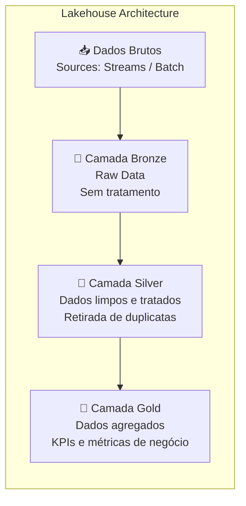
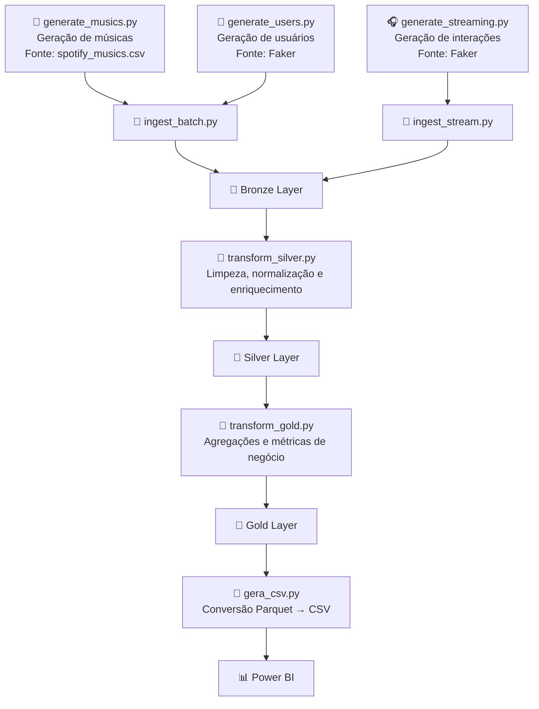

# 4. Arquitetura — Fluxo de Dados

## 🏗️ Arquitetura do Pipeline


### Justificativa da arquitetura

A escolha do modelo Lakehouse permite combinar a Flexibilidade do Data Lake (dados brutos e variados) e a estrutura analítica de um Data Warehouse. Além disso reduz custo (armazenamento barato), permite múltiplos tipos de processamento e facilita evolução do projeto.
Já a arquitetura Medalhão (Bronze, Silver, Gold) utiliza camadas, melhorando a qualidade dos dados, governança e reprodutibilidade.

### Camadas

* Bronze: dados brutos sem transformação
* Silver: dados tratados
      Transformações realizadas:
        Remoção de duplicidades
        Tratamento de valores ausentes
        Conversão de datas
        Padronização de nomes de colunas
        Validação de tipos de dados
* Gold: dados agregados e prontos para consumo

  

  
### Fluxo

1. Origem (eventos + dados batch)
2. Ingestão (streaming e batch)
3. Armazenamento (Data Lake)
4. Processamento
5. Consumo

### Stack


### Estrutura

```bash
project/
├── scripts/
│   ├── generate_musics.py
│   ├── generate_streaming.py
|   ├── generate_users.py
|   ├── gera_csv.py
│   ├── ingest_batch.py
│   ├── ingest_stream.py
│   ├── transform_silver.py
│   ├── transform_gold.py
│   └── orchestrator.py
│
├── data/
│   ├── raw/    
│   ├── bronze/   
│   ├── silver/
│   └── gold/
│
├── logs/
│   └── pipeline.log
│
└── README.md
```


### Armazenamento
O armazenamento será baseado em um Data Lake local, organizado segundo a arquitetura medalhão, onde os dados brutos serão armazenados no formato JSON/CSV e os dados tratados e agregados em Parquet.
Estrutura: 
•	Bronze → dados brutos 
•	Silver → dados tratados 
•	Gold → dados agregados 
Os dados Bronze não terão alterações e serão armazenados como obtidos.

### Processamento e transformação
O processamento será realizado em dois modos:
•	Batch: Utilizando Python com pandas para limpeza de dados, junções entre tabelas e agregações (ex: top músicas) 
•	Streaming (simplificado):
Processamento incremental dos eventos à medida que chegam (simulado) 

### Orquestração
A execução do pipeline é realizada pelo script python orchestrator.py, responsável por gerenciamento de fluxos de trabalho (Data Pipelines): Em projetos de dados (como ETL), ele garante que uma etapa de extração só comece após a conclusão da limpeza dos dados, controlando a dependência entre as tarefas. 
No caso deste projeto, controlará a geração dos dados, ingestão e transformação.

Etapas executadas:
1.  generate_musics.py,            geração do arquivo de músicas a partir do arquivo spotfy_musics.csv
2.	generate_streaming.py,         geração do arquivo de interações a partir do faker
3.	generate_users.py,             geração do arquivo de usuários a partir do faker
4.	ingest_batch.py,               ingestão dos dados de usuários e músicas na camada bronze
5.	ingest_stream.py,              ingestãos dos dados de interações na camada bronze
6.	transform_silver.py,           transformação dos dados bronze em silver
7.	transform_gold.py,             transformação dos dados silver em golg, deixando-os prontos para consumo
8.	gera_csv,                      cópia dos arquivos .parquet para .csv para utilização no Power BI

   ## 🔄 Fluxo do Pipeline de Dados


   
### Trade-offs
Os trade-offs foram considerados visando equilibrar simplicidade de implementação em ambiente acadêmico com boas práticas de arquiteturas modernas de dados. 


### 4.5 Trade-offs

| Aspecto         | Decisão                               | Impacto  | Justificativa                        |
| --------------- | ------------------------------------- | -------- | ------------------------------------ |
| Acoplamento     | Arquitetura em camadas                | Baixo    | Facilita manutenção                  |
| Escalabilidade  | Separação armazenamento/processamento | Alta     | Crescimento sem mudanças estruturais |
| Disponibilidade | Batch + Streaming                     | Moderada | Depende dos pipelines                |
| Confiabilidade  | Dados brutos no Bronze                | Alta     | Permite reprocessamento              |
| Reversibilidade | Preservação dos dados                 | Alta     | Correção sem perda                   |
| Latência        | Batch vs Streaming                    | Variável | Equilíbrio custo/tempo               |
| Complexidade    | Arquitetura híbrida                   | Alta     | Necessária para múltiplos cenários   |
| Custo           | Data Lake                             | Baixo    | Armazenamento econômico              |

---
